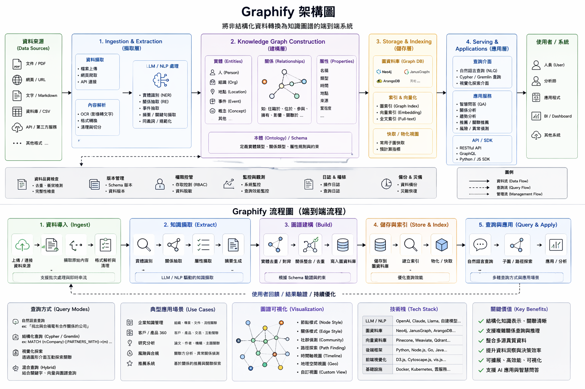

# Hybrid Knowledge System（Wiki + Graph + Vector）

## 1. 定位

HKS 是一個 local-first、CLI-first、domain-agnostic 的知識系統。  
現在的 runtime 狀態：

* Phase 1：完成
* Phase 2：完成
* Phase 3：完成（`004` image ingest、`005` lint system、`006` MCP / API adapter、`007` multi-agent support）

---

## 2. 架構

* Data Layer
  * `raw_sources/`：immutable 原始檔
  * `wiki/`：人可讀摘要與 write-back pages
  * `graph/graph.json`：entity / relation
  * `vector/db/`：embedding retrieval
* Processing Layer
  * ingestion pipeline：parse → normalize → extract → update
  * query pipeline：routing backend → wiki / graph / vector → fallback / write-back
* Tool Layer
  * `ks ingest`
  * `ks query`
  * `ks lint`
  * `ks coord`
  * `hks-mcp`
  * `hks-api`（optional loopback facade）




---

## 3. CLI Contract

```bash
ks ingest <file|dir>
ks query "<question>" [--writeback auto|yes|no|ask]
ks lint
ks coord session|lease|handoff|status|lint
hks-mcp --transport stdio|streamable-http
hks-api
```

stdout 契約統一：

```json
{
  "answer": "...",
  "source": ["wiki", "graph", "vector"],
  "confidence": 0.0,
  "trace": {
    "route": "wiki|graph|vector",
    "steps": []
  }
}
```

`ks ingest`、`ks query`、`ks lint`、`ks coord` 共用同一 top-level JSON shape。
`hks-mcp` 與 `hks-api` 的成功 payload 也共用此 shape；adapter 錯誤才使用 `{ok:false,error:{code,exit_code,message,details},response?}` envelope。

---

## 4. Ingestion Pipeline

1. parse
   * Phase 1：`txt / md / pdf`
   * Phase 2：`docx / xlsx / pptx`
   * Phase 3：圖片 ingest（`png / jpg / jpeg`；OCR-only，VLM / `.heic` / `.webp` 延後）
2. normalize
3. extract
   * key facts
   * entities
   * relations
4. update
   * wiki
   * graph
   * vector

目前 graph extraction 是 pattern-based，目的不是做最強 NLP，而是穩定支撐離線 relation query 與 regression tests。
目前 `004` 已把獨立圖片 ingest 凍結為 `png / jpg / jpeg` + local OCR。VLM、`.heic` / `.webp` 與更泛化的 normalize/轉檔策略仍留待後續 spec。

---

## 5. Query Routing

### 5.1 Route 偏好

* summary / overview → wiki
* relation / impact / dependency / why → graph
* detail / clause / excerpt → vector

### 5.2 Routing backend

* 現在的 routing 是 model-driven，不再直接走單純 keyword if/else
* repo 預設 backend 是本機 deterministic semantic router
* `HKS_ROUTING_MODEL` 保留為未來接本機 prompt model 的入口

### 5.3 Fallback

* wiki miss → vector
* graph miss → vector
* no hit → `source=[]`, `confidence=0.0`, exit code 仍為 `0`

---

## 6. Write-back

### 目前行為

* 預設模式：`auto`
* `confidence >= HKS_WRITEBACK_AUTO_THRESHOLD`（預設 `0.75`）→ 自動回寫 wiki
* `--writeback=no` → 禁用
* `--writeback=yes` → 強制回寫
* `--writeback=ask` → 舊互動模式，相容保留

自動 write-back page 會帶 `## Related`，連回本次答案涉及的既有 wiki pages。

---

## 7. Graph Schema

### Entity types

* `Person`
* `Project`
* `Document`
* `Event`
* `Concept`

### Relations

* `owns`
* `depends_on`
* `impacts`
* `references`
* `belongs_to`

graph persistence 位於 `/ks/graph/graph.json`。

---

## 8. Runtime Layout

```text
/ks
  /raw_sources
  /wiki
    index.md
    log.md
    /pages
      <slug>.md
  /graph
    graph.json
  /vector
    db/
  /coordination
    state.json
    events.jsonl
  /manifest.json
```

`manifest.json` 以 `relpath + sha256 + parser_fingerprint` 對應 derived artifacts，現在包含：

* `wiki_pages`
* `graph_nodes`
* `graph_edges`
* `vector_ids`

`coordination/state.json` 存 agent sessions、resource leases、handoff notes；`events.jsonl` 是 append-only coordination event log。

---

## 9. Multi-agent Coordination

`ks coord` 是 local-first coordination layer，不提供 RBAC 或多使用者隔離。

* `session`：agent 宣告 presence、heartbeat、close；同一 agent 不重複建立 active session
* `lease`：對 logical `resource_key` 取得 ownership；claim / renew / release 在 coordination lock 內完成
* `handoff`：記錄 summary、next_action、references、blocked_by
* `status`：查 sessions / leases / handoffs
* `lint`：檢查 missing references 與 stale active leases

MCP 暴露 `hks_coord_session`、`hks_coord_lease`、`hks_coord_handoff`、`hks_coord_status`；HTTP facade 暴露 `/coord/session`、`/coord/lease`、`/coord/handoff`、`/coord/status`。

---

## 10. Phase Status

### Phase 1

* [x] CLI
* [x] wiki + vector
* [x] rule-based baseline
* [x] ingest：`txt / md / pdf`
* [x] 半自動 write-back
* [x] `ks lint` 初始介面（已由 Phase 3 lint system 取代）

### Phase 2

* [x] ingest：`docx / xlsx / pptx`
* [x] graph extraction
* [x] graph query
* [x] model-driven routing
* [x] 全自動 write-back

### Phase 3

* [x] lint system
* [x] 多 agent 支援
* [x] API / MCP adapter
* [x] 圖片 ingest（`png / jpg / jpeg`；OCR-only）

---

## 11. Runtime configuration

常用環境變數不在本文件重複列完整清單，避免 drift。請以 [readme.md#常用環境變數](../readme.md#常用環境變數) 與 [README.en.md#useful-environment-variables](../README.en.md#useful-environment-variables) 為準。

檔案大小上限分三組：`HKS_MAX_FILE_MB` 管 `txt / md / pdf`，`HKS_OFFICE_MAX_FILE_MB` 管 Office，`HKS_IMAGE_MAX_FILE_MB` 管 image。

---

## 12. 非目標

目前仍不做：

* UI
* 多使用者 / RBAC
* 雲端部署
* microservice
* 非文字素材（影片、音訊）
